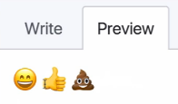

# Markdown

**Markdown** é uma linguagem simples de marcação originalmente criada por [John Gruber](https://daringfireball.net/projects/markdown/). Ela converte texto em HTML válido.  
É a linguagem oficial de documentação no [GitHub](https://guides.github.com/features/mastering-markdown/). Toda a documentação da [Microsoft](https://docs.microsoft.com/) é escrita nela. É bem mais simples usá-la em artigos e documentação do que o html pelo fato de não precisarmos ficar fechando tags.  
Como acabou tornando-se um padrão de documentação é importante para todo desenvolvedor conhecê-la e saber utilizá-la.

---

## Principais Marcadores

### 1 - Cabeçalhos (equivalente a h1-h6 do html):
Para criar, basta utilizar de uma a seis cerquilha(s) antes do texto

# Titulo 1
## Titulo 2
### Titulo 3
#### Titulo 4
##### Titulo 5
###### Titulo 6

```markdown
# Titulo 1
## Titulo 2
### Titulo 3
#### Titulo 4
##### Titulo 5
###### Titulo 6
```

### 2 - Parágrafos
Basta escrever uma ou mais frases. Para quebrar apenas uma linha, use dois espaços seguido de enter.  
Para quebrar uma linha com espaçamento maior, dê dois enter no final pulando uma linha, que será criada outra tag `<p>`.

Agora estamos em outra linha.
Talvez não de certo(no preview), mas no GitHub dá. Outra maneira(workaround) é usar a tag `<br>` do html.<br>Agora sim, até no preview estamos em outra linha. 

### 3 - Ênfase 

**Negrito** basta colocar dois asteriscos ou dois _(underline) antes e depois do texto:

```md
**Negrito**
__Negrito__
```
*Itálico* basta colocar um asteriscos ou um _(underline) antes e depois do texto:

```md
*Itálico*
_Itálico_
```
***Negrito e Itálico*** ao mesmo tempo, basta utilizar os dois, ou seja três asteriscos, três underline ou mesclar as duas formas:

```md
***Negrito e Itálico***
___Negrito e Itálico___
**_Negrito e Itálico_**
__*Negrito e Itálico*__
```

~~Riscado~~, utilizar dois ~(til) antes e depois:

```md
~~Riscado~~
```

> Citação, basta colocar um sinal de >(maior) no início do parágrafo:

```md
> Esta é uma citação.
```

> Citação, com **Negrito** e *Itálico*, basta iniciar com a citação e utilizar os dois:

```md
> Esta é *uma* **citação**.
```

### 4 - Linhas horizontais

Basta utilizar três *(asteriscos) ou três -(traços), pode também colocar espaços entre eles, e colocar mais asteriscos ou traços, que é ignorado, mas pode facilitar na hora de visualizar somente o código markdown:

***

```md
***
---
* * *
- - -
**************************************
--------------------------------------
```

### 5 - Listas não ordenadas

* Item 01
* Item 02
* Item 03

Basta colocar um *(asterisco), um -(traço) ou +(mais) na frente dos itens:

```md
* Item 01
* Item 02
* Item 03

- Item 01
- Item 02
- Item 03

+ Item 01
+ Item 02
+ Item 03
```
Para criar subitens basta identar, usando o tab:

* Item 01
    * Subitem 1
    * Subitem 2
* Item 02
* Item 03

```md
* Item 01
    * Subitem 1
    * Subitem 2
* Item 02
* Item 03

* Item 01
    - Subitem 1
    - Subitem 2
* Item 02
* Item 03

- Item 01
    + Subitem 1
    - Subitem 2
* Item 02
* Item 03
```

Para espaçar um pouco mais os itens, basta dar enter entre eles:

* Item 01
    - Subitem 1

    - Subitem 2

* Item 02
    - Subitem 3
    - Subitem 4

* Item 03

```md
* Item 01
    - Subitem 1

    - Subitem 2

* Item 02
    - Subitem 3
    - Subitem 4

* Item 03
```

### 6 - Listas ordenadas

Basta colocar um número seguido de .(ponto):

1. Item 01
2. Item 02
3. Item 03

```md
1. Item 01
2. Item 02
3. Item 03

1. Item 01
1. Item 02
1. Item 03
```

A lista inicia pelo primeiro número informado:

5. Item 05
666. Item 06
1. Item 07

```md
5. Item 05
6. Item 06
7. Item 07

5. Item 05
666. Item 06
2. Item 07
```

### 7 - Links

Para criar um link basta utilizar colchetes em volta do texto, seguido de parênteses contendo o link em sí `[Texto clicável](link)`:

[Vai para o site do Ricardo Ramires](http://flexbr.com/)

```md
[Vai para o site do Ricardo Ramires](http://flexbr.com/)
```

Para utilizar o alt text, basta dar um espaço e colocálo entre aspas:

[Vai para o site do Ricardo Ramires](http://flexbr.com/ "Clique nesse link para ser redirecionado")

Outra forma, é criar uma variável contendo o link e depois acessá-la:

[url-do-google]: http://www.google.com
[Clique para ir ao Google][url-do-google]

```md
[url-do-google]: http://www.google.com
[Clique para ir ao Google][url-do-google]
```

Isso pode ser útil para um link que será utilizado muitas vezes, facilitando alterar em um único local.

### 8 - Imagens

Para inserir imanges, é similar ao link. Colchetes com o nome, seguidos de parênteses com o enrereço da imagem. Só que no início vai um ponto de !(exclamação) ``


```md

```

Outra maneira é utilizando variáveis, como já vimos no link:

[path-da-imagem]: img/watchmen.png
![Figura do Watchmen][path-da-imagem]

```md
[path-da-imagem]: img/watchmen.png
![Figura do Watchmen][path-da-imagem]
```

Imagem com link, basta colocar a imagem dentro dos colchetes que é a área clicável do link:

[](http://www.google.com)

```md
[](http://www.google.com)
```

Para usar variáveis para o link e imagem, basta criá-las e substituir onde iria o caminho e a url:

[url-google]: http://www.google.com
[path-da-imagem-google]: img/google.png

[![Logo Google][path-da-imagem-google]][url-google]

```md
[url-google]: http://www.google.com
[path-da-imagem-google]: img/google.png

[![Logo Google][path-da-imagem-google]][url-google]
```

### 9 - Tabelas

Para criar uma tabela, basta usar um `|` pipe entre os valores das colunas e usar na outra linha ` - |` traco pipe para o markdown identificar uma tabela:

Nome | E-mail | Telefone 
- | - | - 
Fulano | fula@teste.com | 2222-2222 
Sicrano | sic@teste.com | 3333-2222 
Beltrano | bel@teste.com | 98888-7777 

```md
Nome | E-mail | Telefone 
- | - | - 
Fulano | fula@teste.com | 2222-2222 
Sicrano | sic@teste.com | 3333-2222 
Beltrano | bel@teste.com | 98888-7777  
```

Por padrão o alinhamento das células é a esquerda. Para mudar, basta utilizar `:` dois pontos na segunda linha, que é a de controle:
`:- esquerda, :-: centro e -: direita`

Nome | E-mail | Telefone 
:- | :-: | -: 
Fulano | fulano@teste.com | 2222-2222 
Sicrano | sic@teste.com | 3333-2222 
Beltrano | belt@teste.com | 98888-7777

```md
Nome | E-mail | Telefone 
:- | :-: | -: 
Fulano | fulano@teste.com | 2222-2222 
Sicrano | sic@teste.com | 3333-2222 
Beltrano | belt@teste.com | 98888-7777
```

### 10 - Blocos de Código

Para criar blocos de código, existem duas formas. Em linha, bastanto usara crase:  

Informe os parâmetros `username` e `password` para a função `login()`.

```md
Informe os parâmetros `username` e `password` para a função `login()`.
```

Outra maneira é dar tab, que ele identifica como bloco:

    function login(username, password){

    }

Ficaria assim no texto, identado com o tab:

```md
    function login(username, password){

    }
```

E finalmente para blocos de código com **highlighting** use três crases antes, o apelido da linguagem (md = Markdown, js = Javascript, html, etc) e três crases no final:  

```js
// login method
function login(username, password){
    
}
```

````md
```js
// login method
function login(username, password){

}
```
````

No site da Microsoft tem a lista com os outros apelidos das linguagens:

[Microsoft how-to-write-use-markdown](https://docs.microsoft.com/pt-br/contribute/how-to-write-use-markdown)


### 11 - Alguns extras no GitHub

No GitHub é possível utilizar colchetes para fazer 'checks':


```md
* [x] Item um
* [ ] Item dois
* [x] Item três
```
Isso é interessante por exemplo para indicar as partes do projeto ou código que foram concluídas.

Também é possivel utilizar Emojis:



```md
:smile: :+1: :shit:
```

A lista completa de Emojis, você encontra aqui:

[EMOJI CHEAT SHEET](https://www.webfx.com/tools/emoji-cheat-sheet/)

Isso é tudo que eu queria mostrar, pessoal!

